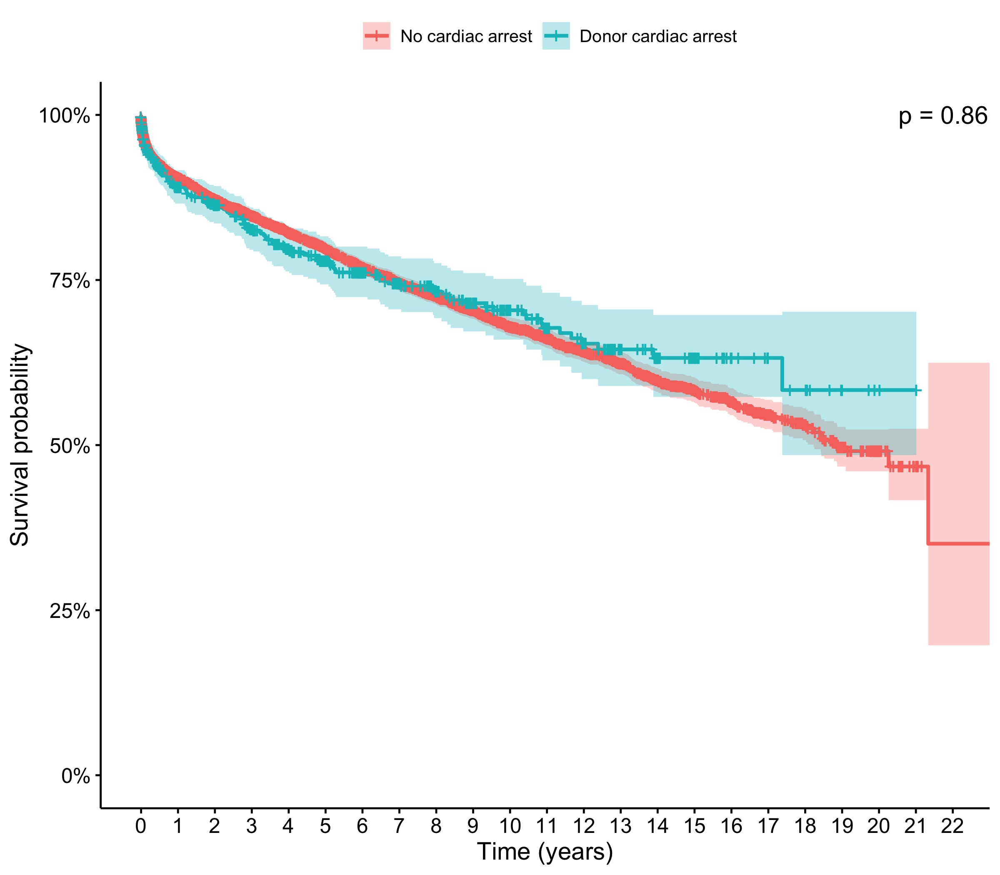

```{r setup, include=FALSE}
knitr::opts_chunk$set(echo = TRUE)
```

# Introduction and Objective

# Methods

## Statistical Analysis

Filters:

-   Pediatric

-   Transplant

-   Organ = Heart

-   No missing for PTIME, PSTATUS and CARDARREST_POSTNEURO_DON

# Appendix

```{r plots, echo=FALSE, message=FALSE, warning=FALSE}

# Running script
source('2 - Analysis.R')
source('2 - Analysis - Regression.R')

```

```{r, echo=FALSE, message=FALSE, warning=FALSE}

library(tidyverse)
library(gtsummary)

tab1_rec %>% 
  as_flex_table()

tab1_don %>% 
  as_flex_table()

tab2 %>% 
  as_flex_table()

```

Adjusted for recipient age, recipient gender, recipient BMI, BMI mismatch, weight mismatch, recipient creatine, distance from donor hospital to transplant center, length of stay post transplant, donor age, donor race, donor creatine, donor cigarette use in past at \> 20pack years, donor clinical infection, donor arginine vesopressin within 24h pre cruss clamp, donor diuretics within 24 hrs procuremen, donor antihypertensives within 24h pre-cross clamp.



```{r, echo=FALSE, message=FALSE, warning=FALSE}

cox.zph(fit_cox)

```
